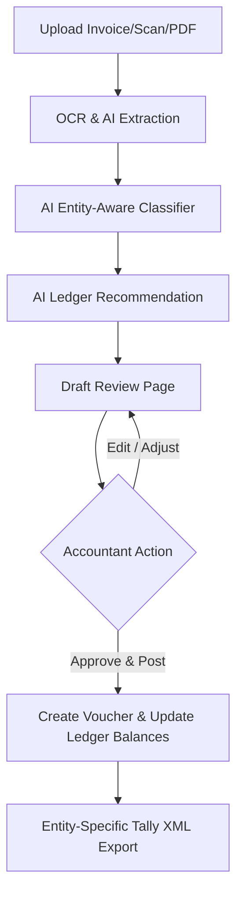

# AI Accounting & Finance Assistant Documentation

This document outlines the architecture, workflows, database models, and APIs added to support the new intelligent, document-driven accounting system with multi-entity support.

---

## 1. System Overview & Safety Constraints
To maintain strict compliance and auditing standards, the AI system operates in a **Draft-Only Mode**:
* **No Auto-Posting:** The AI never posts voucher entries or modifies the General Ledger autonomously.
* **No Auto-Reconciliation:** Bank matches are recommended but require accountant verification.
* **No Auto-Deletion:** The system never deletes files, uploads, or historical audit records.
* **Complete Backward Compatibility:** Existing manual voucher entry and Tally export paths are fully preserved.

---

## 2. Multi-Entity Accounting & GST Separation
The system supports completely independent accounting for multiple legal entities:

### Entity 1: Hope Neurotrauma & Multispeciality Hospital
* **GSTIN:** `27HOPEH1234A1Z1`
* **Isolated Books:** Separate Chart of Accounts, Ledgers, Cost Centres, and Financial Statements.
* **Key Ledgers Suffix:** `(Hope)` (e.g., `Cash (Hope)`, `Electricity (Hope)`).

### Entity 2: Care Diagnostics
* **GSTIN:** `27CARED5678B1Z2`
* **Isolated Books:** Separate Chart of Accounts, Ledgers, Cost Centres, and Financial Statements.
* **Departmental Accounting:** Configured departments for Radiology, Laboratory, Pharmacy, Ultrasound, CT, MRI, X-Ray, and Administration.
* **Pharmacy Sub-Entity Isolation:** The Pharmacy has its own GST reporting and purchase/sales registers (`Pharmacy GST Input (Care)`, `Pharmacy GST Output (Care)`) while remaining part of the Care Diagnostics accounting books.

---

## 3. Workflows & Architecture

### A. Smart Expense Entry & OCR Workflow
1. **Intake Channels:** Users can upload invoices via JPG, PNG, HEIC, WebP, single/multi-page PDFs, or CSV.
2. **Extraction Engine:** The backend processes the document through an simulated OCR parsing API (`POST /api/accounting/expenses/ocr`) extracting:
   * Vendor Name, Invoice Number, Invoice Date, due date.
   * Tax breakdown (CGST, SGST, IGST, invoice amount, total amount).
   * Payment mode & reference (e.g. UTR).
   * Classification metadata (Department, Cost Centre, Branch).
   * Handwritten notes if present.

### B. Entity-Aware AI Accounting
* The AI engine inspects document content keywords to classify transactions between **Hope Hospital** and **Care Diagnostics**.
* **MRI Helium / CT Maintenance / Lab Reagents:** Auto-classified under **Care Diagnostics** with correct department mappings (e.g., MRI/CT under Radiology, Reagents under Laboratory).
* **Hospital Medicines / ICU Equipment:** Auto-classified under **Hope Hospital**.
* Predicts the target Expense, Vendor, GST, and Cash/Bank accounts specific to the suggested entity.

### C. Smart Approval Workflow
1. **Review Stage:** Documents are stored in `financial_documents` with `status = 'draft'`.
2. **Edit Stage:** The Accountant reviews extracted fields, modifies ledger assignments, and overrides recommendations (including changing the target Entity or Department).
3. **Approve Stage:** Upon hitting "Approve", the backend performs duplicate checks. If passed, it generates a standard `Payment` or `Purchase` voucher under the chosen entity, updates ledger balances, and updates the document status to `approved`.

### D. Duplicate Detection Engine
Prevents duplicate entries by checking:
* Whether the exact invoice number already exists in `financial_documents` for the specific entity.
* Vendor name + invoice amount + date matches.
* GSTIN invoice double-claiming.

### E. Bank Statement Import & AI Reconciliation
1. **Bank Import:** Accountants upload PDF/CSV/Excel statements.
2. **Field Extraction:** Date, Description, Reference/UTR, Cheque Number, Credit, Debit, and Running Balance are extracted.
3. **Reconciliation Matcher:** The AI suggests matches against Patient Receipts, OPD/IPD Payments, and Vendor payments with confidence scores (`High`, `Medium`, `Low`).

### F. Organization Learning System
* Over time, when accountants override recommendations or repeatedly approve specific mappings (e.g., mapping "Cipla" to "Pharmacy Purchase (Care)"), the system saves these patterns into `organization_learnings`.
* Future OCR runs query this table to auto-apply preferred mappings.

---

## 4. Consolidated Management Reporting
Although statutory accounting remains completely separate, the system provides optional combined reports combining both entities for internal management analysis only:
* **Combined Revenue**
* **Combined Expenses**
* **Combined Net Profit**
* **Combined Cash Flow**
* **Combined Department-wise Profitability**
* **Combined Outstanding Receivables**
* **Combined Bank Position**
* **Notice:** These reports are clearly marked: *"Internal Management Report Only: Not for Statutory GST, TDS or Tax Filings."*

---

## 5. Database Schema Updates
Added two new tables in [accounting.ts](file:///c:/Users/abina/.gemini/antigravity/scratch/hospital_erp_synology_perfect/hospital_erp/lib/db/src/schema/accounting.ts):

1. **`financial_documents`**:
   * Stores URL, document name, OCR text payload.
   * `extracted_fields` (JSONB) and `ledger_recommendations` (JSONB).
   * `linked_voucher_id` referencing `vouchers`.
   * `approval_history` & `audit_trail`.

2. **`organization_learnings`**:
   * Stores patterns (e.g., vendor keyword), `recommended_ledger_id`, and match counts.

---

## 6. APIs Added
All route handlers are declared under [accounting.ts](file:///c:/Users/abina/.gemini/antigravity/scratch/hospital_erp_synology_perfect/hospital_erp/artifacts/api-server/src/routes/accounting.ts):

* `POST /api/accounting/expenses/ocr`: Performs OCR parsing & mock AI ledger lookup.
* `GET /api/accounting/financial-documents`: Retrieves list of uploaded documents with advanced search filters.
* `PUT /api/accounting/financial-documents/:id`: Modifies draft OCR fields and recommendations.
* `POST /api/accounting/financial-documents/:id/approve`: Performs double-booking verification, creates voucher, and updates ledger balances.
* `POST /api/accounting/bank-statement/import`: Parses statement uploads and populates unreconciled bank entries.
* `GET /api/accounting/alerts`: Returns compliance alerts (GST variance, large cash payments >20k, duplicates).
* `GET /api/accounting/dashboard`: Aggregates pending reviews, unmatched items, and counts.
* `GET /api/accounting/tally/export`: Exports vouchers in Tally ERP 9 / TallyPrime XML format.
* `GET /api/accounting/consolidated-report`: Aggregates financials from both entities for combined management reports.

---

## 7. Tally XML Export Architecture
The export engine generates standard Tally XML:
* Uses the `<ENVELOPE>`-based import structure.
* Validates that total debits match credits before compilation.
* Maps `vouchers` to `ALLLEDGERENTRIES.LIST` correctly.
* Supports filters by Date Range, Financial Year, Voucher Type, Branch, and Department.
* Enforces entity isolation by only exporting vouchers corresponding to the selected entity.

---

## 8. Testing & Build Verification
* **Frontend Verification:** `pnpm --filter @workspace/hms run typecheck` passed with 0 errors.
* **Frontend Production Build:** `pnpm --filter @workspace/hms run build` succeeded.
* **Backend Verification:** `pnpm --filter @workspace/api-server run build` built the backend bundle successfully.
* **Database Verification:** `drizzle-kit push` successfully pushed schema changes to PostgreSQL.
