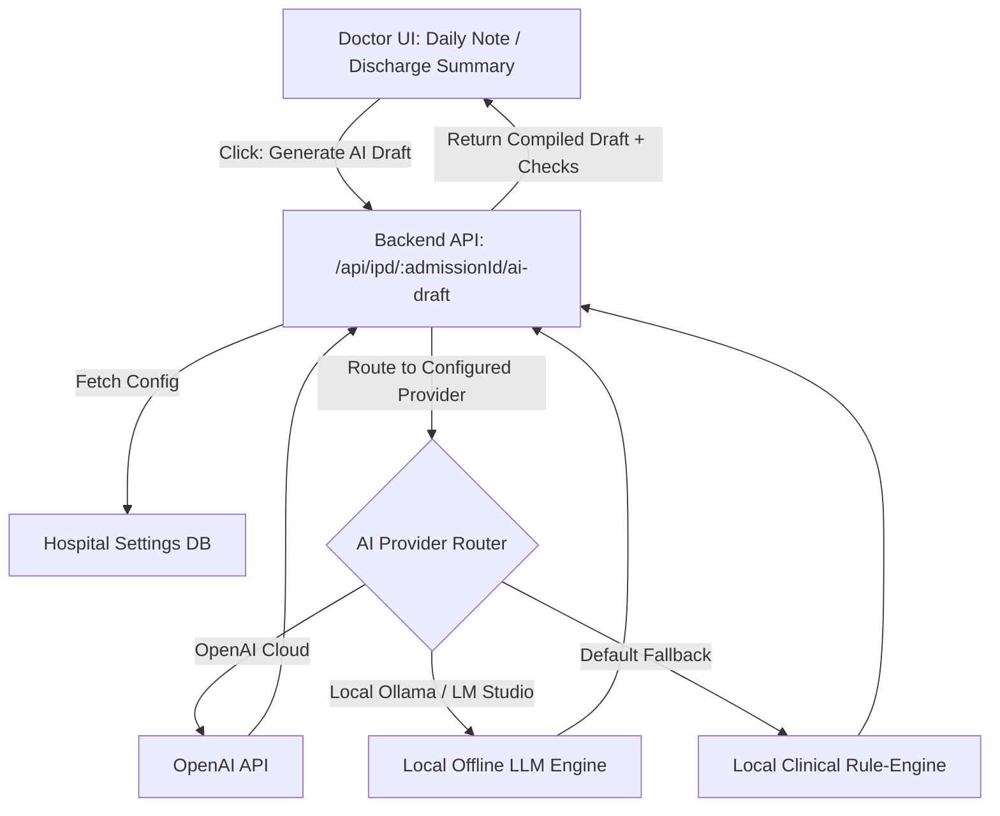
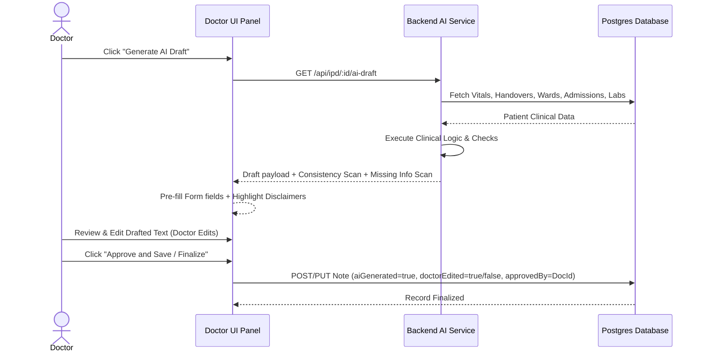

# AI Clinical Assistant — Safe Draft Mode

This document outlines the architecture, clinical safety mechanisms, approval workflows, and implementation details of the AI Clinical Assistant implemented for **Hope Neurotrauma & Multispeciality Hospital**.

---

## 1. Executive Safety Principles

Patient safety and professional medical accountability are the foundation of this system:
1. **Never Autonomous:** The AI assistant *never* creates, saves, or finalizes any clinical record autonomously.
2. **Draft-Only Role:** The AI is strictly a supportive "drafting engine" that pre-fills forms for doctors.
3. **No Overwrite:** The AI *never* overwrites existing doctor-authored documentation.
4. **Mandatory Doctor Sign-off:** Every note must be reviewed, edited if necessary, and explicitly signed off ("Approve and Save" or "Finalize") by an authorized physician before becoming part of the permanent medical record.
5. **Mark of AI-Generated Content:** All AI-generated drafts are clearly prefixed with the warning:
   `"AI Draft – Pending Doctor Approval"`

---

## 2. Architecture & Configurable Providers

The system is designed to run in diverse deployment environments, including fully offline hospital intranet installations (e.g., Synology NAS):

### Supported Providers
Different AI backends can be configured directly through the **Hospital Settings** admin panel:
- **Mock / Local Rule-Engine:** The default offline compiler that constructs structured drafts from existing database logs (admission note, vitals, nursing notes). Requires zero API keys or network connection.
- **OpenAI (Cloud):** Uses remote cloud GPT-4o models for high-quality semantic drafting.
- **Ollama / LM Studio / Open WebUI (Local):** Connects to on-premise local LLM hosts for complete data privacy (e.g., Llama 3 running on local servers).

---

## 3. Core Workflow

---

## 4. Verification and Safety Scans

The backend automatically runs verification checks and scans before presenting the draft:

### AI Clinical Consistency Scan
Reviews active documentation for logical discrepancies and lists them as suggestions:
- **Diagnosis Mismatch:** Initial admission diagnosis differs from latest progress note assessment.
- **Medicine Discontinuation Check:** Warns if a medicine marked as stopped in progress notes is still listed.
- **Missing Operation Note:** Warns if procedures are mentioned without a matching surgical note.
- **Allergy Warnings:** Warns if prescribed drugs overlap with patient-documented allergies.

### AI Missing Information Assistant
Highlights critical missing elements as reminders:
- Missing allergies documentation.
- Missing discharge instructions or warning signs.
- Missing progress notes or shift handovers.
- Missing vital signs record on the consultation card.

---

## 5. Specialty-Aware Assistant Templates
The assistant queries the doctor's default specialty (e.g., Neurosurgery, Orthopedics, Pediatrics, OB/GYN, ENT, Ophthalmology, Dermatology, General Surgery, Internal Medicine) defined in Hospital Settings:
- Generates specialty-specific checklist headings (e.g., Neurosurgery: GCS, Cranial nerves, Motor power, Reflexes, Spine exam; Orthopedics: Range of Motion, Joint stability, Gait; ENT: Otoscopy, Anterior rhinoscopy).
- strictly generates headings/checklists only, never fabricating examination findings or patient results.

---

## 6. Investigation Review Assistant
When laboratory or imaging reports are completed or pending:
- Summarizes laboratory abnormalities (flagging high/low/abnormal values).
- Displays completed and pending imaging lists.
- Provides direct hyperlinks back to the original diagnostic order reports for verification (never replaces the original reports).

---

## 7. Prescription Safety Assistant
Before saving prescriptions, real-time safety scans are performed:
- **Duplicate Medicines:** Identifies identical drugs listed multiple times in the sheet.
- **Drug Allergies:** Compares prescribed drugs against patient allergy lists.
- **Duplicate Antibiotics / NSAIDs / Anticoagulants:** Warns if multiple medicines from the same high-alert classes are prescribed simultaneously.
- **High-Risk Medicines:** Flags high-alert medications (e.g., Insulin, Digoxin, Lithium, Warfarin) requiring close monitoring.
- *Prescription warnings are advisory only; the treating doctor retains final decision-making authority.*

---

## 8. Follow-up Intelligence
Automatically suggests follow-up actions and reminders to the doctor:
- Missed scheduled OPD follow-up dates.
- Pending investigations or repeat imaging due.
- Suture removal, post-surgery review, or physiotherapy referrals.

---

## 9. Audit Trail & Database Schema

Every record generated using AI assistance keeps a permanent, un-alterable audit trail:
- `ai_generated`: Boolean flag identifying if an AI draft was used.
- `doctor_edited`: Boolean flag denoting whether the doctor modified the text of the draft.
- `approved_by`: Foreign key pointing to the doctor who reviewed and signed off.
- `approved_at`: Timestamp recording the exact moment of approval.

### Unified Architecture Reuse
All components (OPD, IPD progress notes, discharge summaries) consume the same unified AI assistant backend compiler and share identical schema conventions, avoiding code duplication and ensuring consistent safety levels.

### Modified Files
1. **Drizzle Schemas:**
   - [ipd_progress_notes.ts](file:///c:/Users/abina/.gemini/antigravity/scratch/hospital_erp_synology_perfect/hospital_erp/lib/db/src/schema/ipd_progress_notes.ts)
   - [discharge_summaries.ts](file:///c:/Users/abina/.gemini/antigravity/scratch/hospital_erp_synology_perfect/hospital_erp/lib/db/src/schema/discharge_summaries.ts)
   - [opd.ts](file:///c:/Users/abina/.gemini/antigravity/scratch/hospital_erp_synology_perfect/hospital_erp/lib/db/src/schema/opd.ts) (Extended audit trail)
   - [hospital_settings.ts](file:///c:/Users/abina/.gemini/antigravity/scratch/hospital_erp_synology_perfect/hospital_erp/lib/db/src/schema/hospital_settings.ts)
2. **Backend Routers:**
   - [ai_assistant.ts](file:///c:/Users/abina/.gemini/antigravity/scratch/hospital_erp_synology_perfect/hospital_erp/artifacts/api-server/src/routes/ai_assistant.ts) (OPD assistant, specialty engines, prescription safety check routes)
   - [opd.ts](file:///c:/Users/abina/.gemini/antigravity/scratch/hospital_erp_synology_perfect/hospital_erp/artifacts/api-server/src/routes/opd.ts) (OPD Audit updates)
   - [progress_notes.ts](file:///c:/Users/abina/.gemini/antigravity/scratch/hospital_erp_synology_perfect/hospital_erp/artifacts/api-server/src/routes/progress_notes.ts) (Audit fields)
   - [discharge-summaries.ts](file:///c:/Users/abina/.gemini/antigravity/scratch/hospital_erp_synology_perfect/hospital_erp/artifacts/api-server/src/routes/discharge-summaries.ts) (Audit fields)
3. **Frontend UIs:**
   - [opd/[id].tsx](file:///c:/Users/abina/.gemini/antigravity/scratch/hospital_erp_synology_perfect/hospital_erp/artifacts/hms/src/pages/opd/[id].tsx) (OPD AI draft generation, safety warnings panel, and approval finalization card)
   - [ProgressNotesSection.tsx](file:///c:/Users/abina/.gemini/antigravity/scratch/hospital_erp_synology_perfect/hospital_erp/artifacts/hms/src/components/ProgressNotesSection.tsx)
   - [discharge-summary/index.tsx](file:///c:/Users/abina/.gemini/antigravity/scratch/hospital_erp_synology_perfect/hospital_erp/artifacts/hms/src/pages/discharge-summary/index.tsx)
   - [settings/index.tsx](file:///c:/Users/abina/.gemini/antigravity/scratch/hospital_erp_synology_perfect/hospital_erp/artifacts/hms/src/pages/settings/index.tsx)

