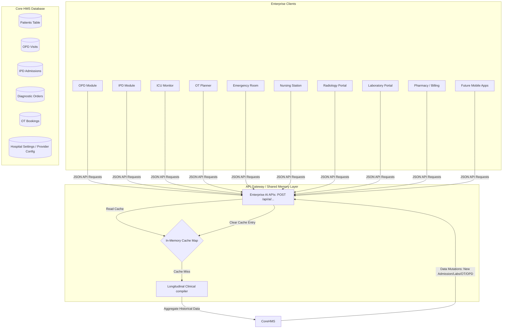

# ENTERPRISE CLINICAL MEMORY ENGINE

The **Enterprise Clinical Memory Engine** is the central, shared longitudinal intelligence layer for the entire Healthcare Platform. It provides a unified patient clinical history across multiple clinical domains (OPD, IPD, ICU, OT, Emergency, Nursing, Radiology, Laboratory, Pharmacy, Billing, and future mobile/external applications), operating on top of the existing AI settings, safety rules, providers, and approval workflows.

---

## 1. Architecture

The engine acts as a query router and compiler. It pulls discrete records from the Core HMS Database and synthesizes them into structured, chronological clinical memories, caching them for high performance.

---

## 2. Shared AI REST APIs

All current and future platform modules consume the following reusable endpoints:

### `POST /api/ai/patient-summary`
Generates a structured one-page longitudinal patient clinical profile.
*   **Request:** `{ "patientId": number, "refresh"?: boolean }`

### `POST /api/ai/patient-timeline`
Creates a chronological history of the patient's entire documented medical journey.
*   **Request:** `{ "patientId": number, "refresh"?: boolean }`

### `POST /api/ai/radiology-summary`
Compiles completed and pending imaging records (MRI, CT, X-ray, Ultrasound, PET-CT, Mammography).
*   **Request:** `{ "patientId": number, "refresh"?: boolean }`

### `POST /api/ai/laboratory-summary`
Collects laboratory results (CBC, LFT, KFT, HbA1c, Lipids, Cultures) with range checks.
*   **Request:** `{ "patientId": number, "refresh"?: boolean }`

### `POST /api/ai/medication-summary`
Aggregates active, past, stopped, high-alert drugs, allergies, and duplicate class therapies.
*   **Request:** `{ "patientId": number, "refresh"?: boolean }`

### `POST /api/ai/clinical-alerts`
Returns safety alerts, recent neurosurgeries/devices, and longitudinal trend patterns.
*   **Request:** `{ "patientId": number, "refresh"?: boolean }`

---

## 3. Caching & Performance Strategy

To ensure zero performance impact on core transactional workflows:
1.  **In-Memory Cache Map:** Cached memory structures are stored in a key-value memory map indexed by `patientId` on the single-process Express server, bypassing database roundtrips.
2.  **Automatic Invalidation:** The cache is automatically deleted when new clinical records are created or edited in the database via central hooks:
    *   **New OPD Consultation:** `POST /api/opd` & `PUT /api/opd/:id`
    *   **IPD Admission / Discharge:** `POST /api/ipd` & `PUT /api/ipd/:id`
    *   **Daily Note / Progress:** `POST /api/ipd/:id/progress-notes`
    *   **Diagnostic Reports / Labs:** `POST /api/diagnostics` & `PUT /api/diagnostics/:id`
    *   **OT Surgery Bookings:** `POST /api/ot` & `PUT /api/ot/:id`

---

## 4. Permission Safety Matrix

Access to the clinical memory endpoints is restricted to authenticated sessions and filtered based on the active role configuration:

| Role | Access Level | Restricted Fields / Scope |
| :--- | :--- | :--- |
| **Admin** / **Doctor** | Full Access | No restrictions. Full longitudinal access. |
| **Nurse** | Limited Clinical | Redacts Diagnoses, Operations, Lab/Radiology text findings. Full access to Medications & Alerts. |
| **Pharmacist** | Medication Focus | Redacts diagnoses, procedures, and reports. Full access to medication-summary & patient demographics. |
| **Receptionist** | Demographic Only | Redacts all clinical summaries, diagnostics, and medications. Only returns age, gender, blood group. |
| **Cashier** | Billing & Status | Redacts all clinical information. Demographics and outstanding dues snapshot only. |

---

## 5. PHI & Logging Safety

*   **No Fictional Data:** The engine aggregates *only* verified database entries. Under no circumstances does the engine extrapolate or fabricate history.
*   **PHI Protection:** Normal application logs do not write patient names, addresses, or clinical parameters. 
*   **Safe Audit Trail:** Access is tracked by logging the `employeeId`, `username`, `role`, and `patientId` for audit purposes without detailing actual PHI.
*   **Error Sanitization:** API errors are handled cleanly; call stack traces containing database attributes are hidden from users and logged internally, displaying a sanitized generic response instead.

---

## 6. Future HMS, RIS, PACS, and Mobile Integration

The engine's REST architecture is designed to accommodate external sources without modifying AI wrappers:
1.  **PACS/RIS Gateway:** External Diagnostic, DICOM, or PACS platforms (e.g., Care Diagnostics RIS) push reports into the core `diagnostic_orders` table. The Clinical Memory Engine will automatically ingest these during the compile loop and invalidate the cache.
2.  **Mobile Apps:** Doctor and Patient mobile apps query `/api/ai/patient-summary` and `/api/ai/patient-timeline` directly, ensuring identical intelligence and safety disclaimers are rendered everywhere.
